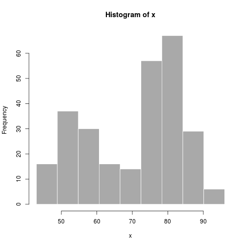

## Introduction

1.Introduction to Failthful Geyser data

---

## Data set


```r
summary(faithful$eruptions)
```

```
##    Min. 1st Qu.  Median    Mean 3rd Qu.    Max. 
##    1.60    2.16    4.00    3.49    4.45    5.10
```

```r
summary(faithful$waiting)
```

```
##    Min. 1st Qu.  Median    Mean 3rd Qu.    Max. 
##    43.0    58.0    76.0    70.9    82.0    96.0
```

---

## Data set plot

 

---

## Slide 5

TODO


