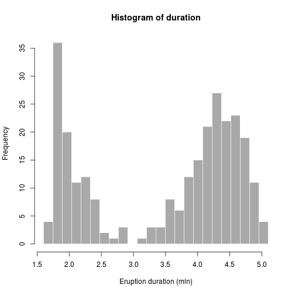

## Introduction to Old Failthful

Old Faithful is a cone geyser located in Wyoming, in Yellowstone National Park in the United States. Old Faithful was named in 1870 during the Washburn-Langford-Doane Expedition and was the first geyser in the park to receive a name. It is one of the most predictable geographical features on Earth, erupting almost every 63 minutes. The geyser, as well as the nearby Old Faithful Inn, is part of the Old Faithful Historic District.


---

## Data set

The chosen dataset contains the waiting time between eruptions and the duration of the eruption for the Old Faithful geyser.
It is stored as a data frame with 272 observations on 2 variables.

* eruptions  numeric  Eruption time in mins
* waiting    numeric  Waiting time to next eruption


```r
summary(faithful$eruptions)
```

```
##    Min. 1st Qu.  Median    Mean 3rd Qu.    Max. 
##    1.60    2.16    4.00    3.49    4.45    5.10
```

```r
summary(faithful$waiting)
```

```
##    Min. 1st Qu.  Median    Mean 3rd Qu.    Max. 
##    43.0    58.0    76.0    70.9    82.0    96.0
```

---

## Scatter plot waiting time vs eruption duration

 

---

## Eruption duration

 


